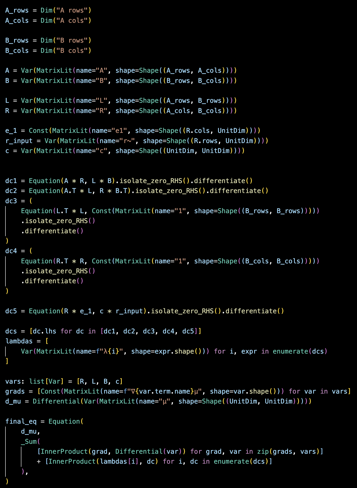
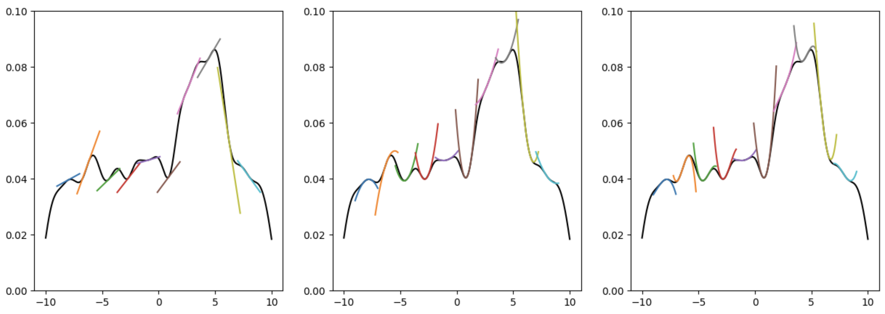

A repository where I collect my experiments with JAX.

Implementation of matrix free jacobian-vector products for QR-decomposition, Cholesky factorization, and bidiagonalization. These are needed for efficient forward-mode automatic differentiation.

Next up are vector-jacobian products of the above, needed for reverse-mode automatic differentiation.

# CAS system for Linalg
Can compute differentials, simplify expressions


Output below. Next would be isolating within all the inner products and grouping them.

```sql
dµ = (〈∇Rµ , dR〉 + 〈∇Lµ , dL〉 + 〈∇Bµ , dB〉 + 〈∇cµ , dc〉 + 〈λ0 , dA · R〉 + 〈λ0 , A · dR〉 + 〈λ0 , - dL · B〉 + 〈λ0 , - L · dB〉 + 〈λ1 , dAᵀ · L〉 + 〈λ1 , Aᵀ · dL〉 + 〈λ1 , - dR · Bᵀ〉 + 〈λ1 , - R · dBᵀ〉 + 〈λ2 , dLᵀ · L〉 + 〈λ2 , Lᵀ · dL〉 + 〈λ3 , dRᵀ · R〉 + 〈λ3 , Rᵀ · dR〉 + 〈λ4 , dR · e1〉 + 〈λ4 , - dc · r~〉 + 〈λ4 , - c · dr~〉)
```

# Random taylor stuff


